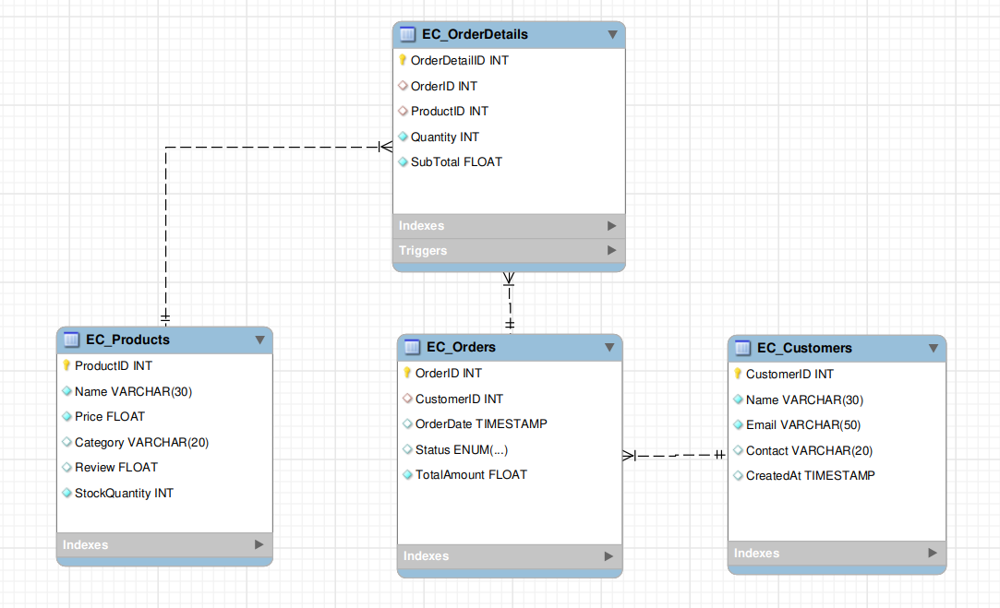

# TASK-10: E-Commerce Application Database Design

## Overview
This document provides a detailed explanation of the database schema for an **E-Commerce Application**. The database is designed to manage customers, products, orders, and order details efficiently. It includes features like triggers, stored procedures, indexing, and views to ensure data integrity, optimize performance, and simplify querying.

---

## Database Schema

### 1. **Tables**

#### **EC_Customers**
Stores customer information.

| Column Name   | Data Type       | Constraints                          |
|---------------|-----------------|--------------------------------------|
| `CustomerID`  | INT             | PRIMARY KEY, AUTO_INCREMENT          |
| `Name`        | VARCHAR(30)     | NOT NULL                             |
| `Email`       | VARCHAR(50)     | NOT NULL, UNIQUE                     |
| `Contact`     | VARCHAR(20)     |                                      |
| `CreatedAt`   | TIMESTAMP       | DEFAULT `current_timestamp`          |

---

#### **EC_Products**
Stores product information.

| Column Name       | Data Type       | Constraints                          |
|-------------------|-----------------|--------------------------------------|
| `ProductID`       | INT             | PRIMARY KEY, AUTO_INCREMENT          |
| `Name`            | VARCHAR(30)     | NOT NULL                             |
| `Price`           | FLOAT           | NOT NULL                             |
| `Category`        | VARCHAR(20)     |                                      |
| `Review`          | FLOAT           | DEFAULT `0`                          |
| `StockQuantity`   | INT             | NOT NULL, CHECK (`StockQuantity >= 0`)|

---

#### **EC_Orders**
Stores order information.

| Column Name       | Data Type       | Constraints                          |
|-------------------|-----------------|--------------------------------------|
| `OrderID`         | INT             | PRIMARY KEY, AUTO_INCREMENT          |
| `CustomerID`      | INT             | FOREIGN KEY REFERENCES `EC_Customers(CustomerID)` ON DELETE CASCADE |
| `OrderDate`       | TIMESTAMP       | DEFAULT `current_timestamp`          |
| `Status`          | ENUM            | DEFAULT `'Pending'`                  |
| `TotalAmount`     | FLOAT           | NOT NULL, CHECK (`TotalAmount > 0`)  |

---

#### **EC_OrderDetails**
Stores details of each order, including the products and their quantities.

| Column Name       | Data Type       | Constraints                          |
|-------------------|-----------------|--------------------------------------|
| `OrderDetailID`   | INT             | PRIMARY KEY, AUTO_INCREMENT          |
| `OrderID`         | INT             | FOREIGN KEY REFERENCES `EC_Orders(OrderID)` ON DELETE CASCADE |
| `ProductID`       | INT             | FOREIGN KEY REFERENCES `EC_Products(ProductID)` ON DELETE CASCADE |
| `Quantity`        | INT             | NOT NULL, CHECK (`Quantity > 0`)     |
| `SubTotal`        | FLOAT           | NOT NULL, CHECK (`SubTotal > 0`)     |

---

### 2. **Indexes**
To optimize query performance, the following indexes are created:
- **`idx_customer_email`**: Index on `EC_Customers.Email`.
- **`idx_order_customer`**: Index on `EC_Orders.CustomerID`.
- **`idx_orderdetails_product`**: Index on `EC_OrderDetails.ProductID`.

---

### 3. **Triggers**

#### **Trigger: `update_stock_totalAmount`**
- **Event**: After an insert operation on `EC_OrderDetails`.
- **Purpose**:
  - Updates the `StockQuantity` in `EC_Products` by reducing the quantity of the ordered product.
  - Updates the `TotalAmount` in `EC_Orders` by summing up the subtotals of all products in the order.

---

### 4. **Stored Procedures**

#### **Procedure: `PlaceOrder`**
- **Purpose**: Handles the process of placing an order, including stock validation, order creation, and updating order details.
- **Parameters**:
  - `p_customer_id`: ID of the customer placing the order.
  - `p_product_id`: ID of the product being ordered.
  - `p_quantity`: Quantity of the product being ordered.
- **Steps**:
  1. Validates if sufficient stock is available.
  2. Calculates the subtotal for the product.
  3. Creates a new order in `EC_Orders`.
  4. Inserts the order details into `EC_OrderDetails`.
  5. Updates stock and total amount using triggers.
- **Error Handling**:
  - Rolls back the transaction if any error occurs.
  - Signals an error message if stock is insufficient or any other issue arises.

---

### 5. **Views**

#### **View: `OrderSummary`**
- **Purpose**: Provides a summary of all orders, including customer name, product name, quantity, order date, total amount, and status.

### ER Diagram
